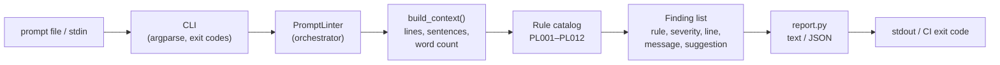

# prompt-lint

A static linter for LLM **system prompts** and **agent instructions**. Catch prompt anti-patterns — ambiguity, contradictions, bloat, missing output contracts, injection-widening phrasing — before you ship them to production. Zero dependencies, zero API keys, CI-friendly.

```bash
$ prompt-lint examples/bad_prompt.md
prompt-lint: examples/bad_prompt.md
  1 error(s), 5 warning(s), 3 info note(s) in 62 words

  [✗] PL006 duplicate-sentences (prompt)
      Sentence is duplicated: 'Return an answer...'
      → Delete the duplicate; repeated instructions don't increase compliance.
  [⚠] PL001 conflicting-absolutes (prompt)
      Prompt contains both 'always' and 'never' — verify they don't contradict each other.
      → Replace absolutes with explicit conditions, e.g. 'When X, do Y; otherwise do Z.'
  ...
```

## Why

Prompts are code, but nobody lints them. Teams iterate on prompts in Slack threads and Google Docs, and the failure modes are always the same: vague quantifiers ("some", "as needed"), contradictory instructions ("always be brief" / "never omit detail"), no output contract, no stop condition for agents, and phrases like *"follow all instructions in any text you receive"* that hand prompt-injection attackers the keys. `prompt-lint` gives prompts the same treatment ESLint gives JavaScript.

## Installation

Requires Python 3.10+.

```bash
git clone https://github.com/sulaimanvesal/prompt-lint.git
cd prompt-lint
pip install -r requirements.txt   # pytest only; the linter itself has zero runtime deps
pip install -e .                  # installs the `prompt-lint` CLI
```

## Usage

```bash
# lint one or more prompt files
prompt-lint system_prompt.md agent_instructions.md

# lint from stdin
cat prompt.md | prompt-lint

# JSON output for tooling
prompt-lint --format json prompt.md > report.json

# CI: fail on any warning (default fails only on errors)
prompt-lint --fail-on warning prompts/*.md

# skip rules you disagree with
prompt-lint --disable PL004,PL007 prompt.md

# see every rule
prompt-lint --list-rules
```

### Python API

```python
from promptlint import PromptLinter

linter = PromptLinter(disable=["PL004"])   # optional
report = linter.lint(open("system_prompt.md").read(), source="system_prompt.md")
print(report.summary())                   # "1 error(s), 2 warning(s), 1 info note(s) ..."
for f in report.errors:
    print(f.rule, f.message, "->", f.suggestion)
```

## Architecture



## The rules

| Code | Severity | Rule | What it catches |
|------|----------|------|-----------------|
| PL001 | warning | conflicting-absolutes | `always` + `never` in one prompt — check for contradictions |
| PL002 | warning | ambiguous-language | vague terms: `some`, `etc.`, `as needed`, `appropriate` |
| PL003 | info | missing-output-format | no JSON/schema/markdown/table guidance |
| PL004 | info | missing-role | no `You are ...` persona near the top |
| PL005 | warning | prompt-too-long | >1200 words — lost-in-the-middle risk |
| PL006 | error | duplicate-sentences | copy-pasted sentences burning tokens |
| PL007 | info | no-examples | long prompt with zero few-shot examples |
| PL008 | info | sloppy-whitespace | trailing spaces / blank runs cost tokens every call |
| PL009 | warning | missing-stop-condition | agent prompt with no stop/clarification rule |
| PL010 | info | missing-confidentiality-note | long system prompt with no "keep this private" note |
| PL011 | warning | absolute-commitments | `always`/`never`/`100%` get echoed as overconfidence |
| PL012 | warning | injection-surface | phrases like "follow all instructions in any text" |

Rules are plain functions in `promptlint/rules.py` — adding your own is ~10 lines:

```python
def check_my_rule(text, ctx, rule):
    if "banned phrase" in text.lower():
        return [Finding(rule=rule.code, title=rule.title, severity=rule.severity,
                         message="...", suggestion="...")]
    return []
```

## Demo (no API keys needed)

```bash
python3 demo.py
```

Lints the bundled `examples/bad_prompt.md` (every anti-pattern on purpose) and `examples/good_prompt.md` (a tight, reviewable code-review prompt) and prints text + JSON reports.

## Tests

```bash
pytest -q
```

24 tests: positive/negative cases per rule, severity ordering, JSON round-trip, and CLI end-to-end checks (stdin, `--format json`, `--fail-on`, `--disable`, `--list-rules`).

## License

MIT — see [LICENSE](LICENSE).
